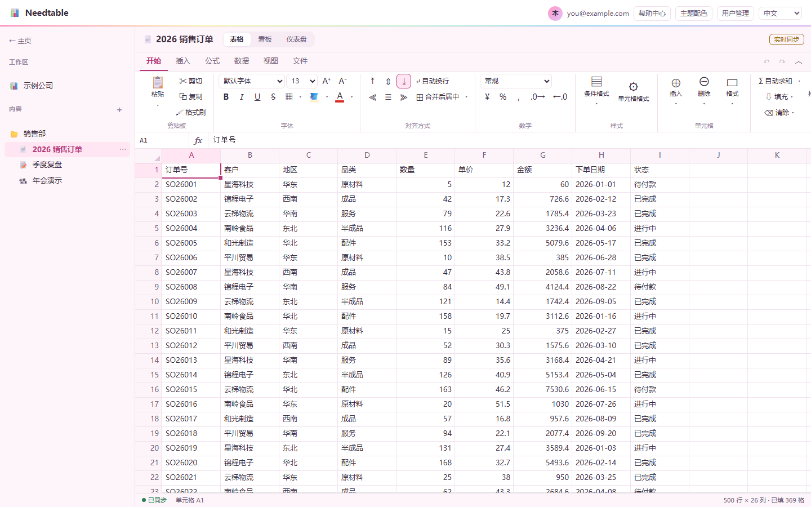
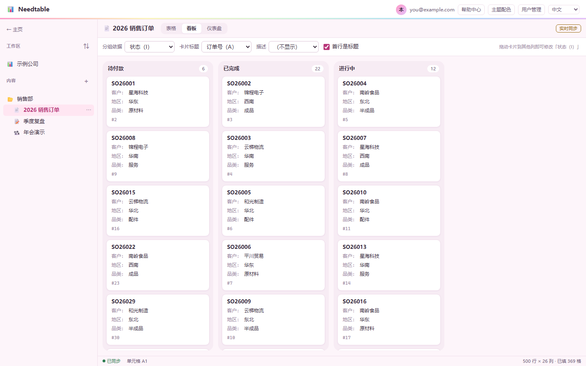
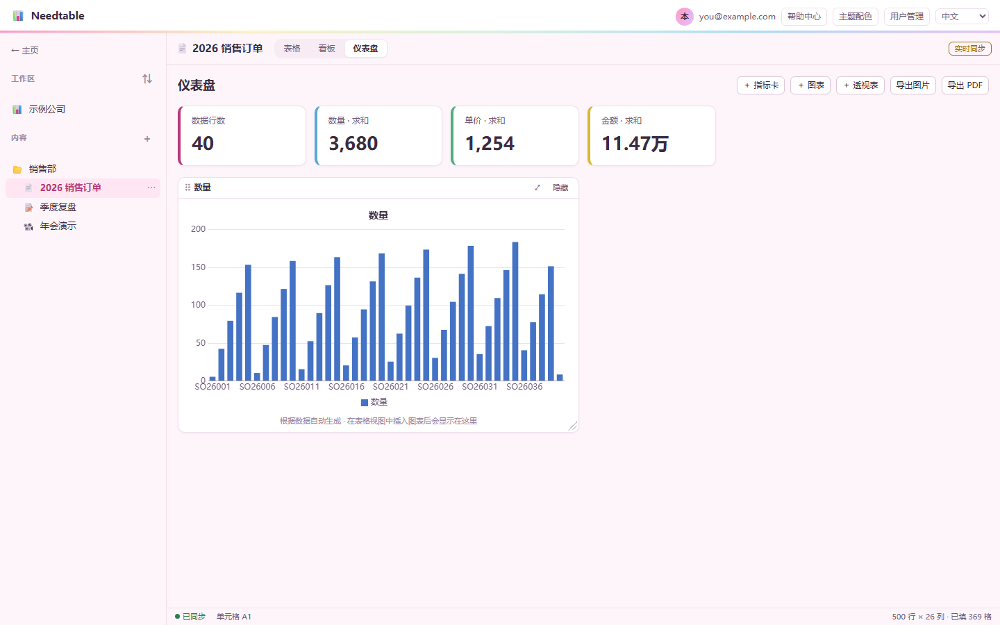
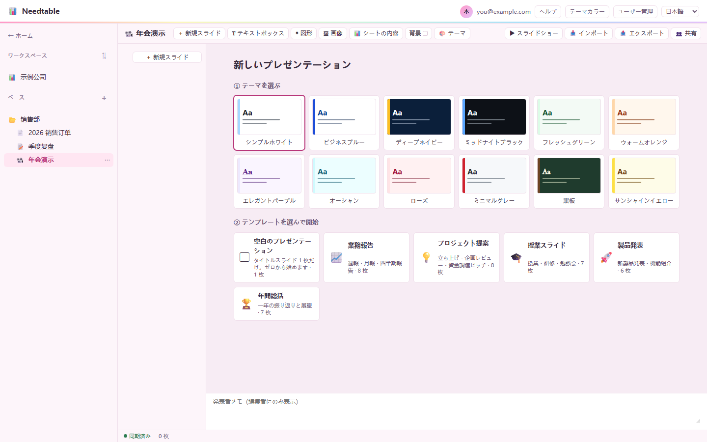
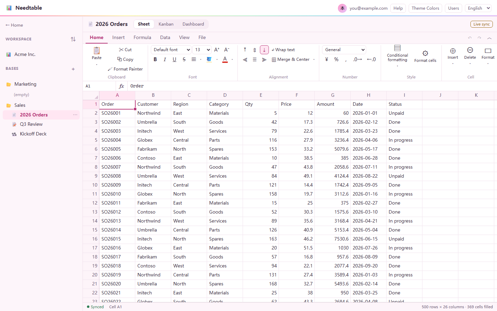

# Needtable

**一个只有受邀的人才能用的在线表格，部署在你自己的 Cloudflare 上，数据在你自己手里。**

中文 · [English](#english)

## 为什么做它

想和几个人一起在线维护一张表，现有的选择都有点别扭：

- **Excel**：桌面版要付费订阅，在线协作还要每个人都有微软账号。
- **Google 表格**：每个人都得注册 Google 账号，国内访问也不方便。
- **WPS 等国产办公软件**：要下载客户端、注册账号，文件存在厂商的服务器上。

Needtable 的做法是：

- **打开浏览器就能用**，不用下载安装任何软件。
- **只有你邀请的人能进**：不开放注册，账号由管理员开通。没登录的人连页面代码都拿不到。
- **自己搭建，隐私好**：代码开源，跑在你自己的 Cloudflare 账号上，数据不经过任何第三方。
- **兼容 Excel**：能导入导出 `.xlsx` / `.csv`，和 Excel 之间直接复制粘贴，常用公式写法一致，上手不用重新学。
- **免费**：只用 Cloudflare 的免费额度，不用绑信用卡。

## 能做什么

- **表格**：公式和函数、数字格式、条件格式、合并单元格、冻结行列、数据验证和多级下拉、查找替换、撤销重做
- **分析**：透视表、柱形 / 条形 / 折线 / 面积 / 饼图、看板、可拖拽排版的仪表盘（能导出 PNG / PDF）
- **文档和幻灯片**：可以嵌入表格里的数据和图表，表格改了它们跟着更新；支持导入导出 Word、PowerPoint、PDF
- **多人协作**：实时同步，能看到别人的光标；断网时的修改联网后自动补上
- **权限**：按工作区、内容、单张表分享，分所有者、管理者、可编辑、只读四级；也可以生成公开只读链接
- **多语言界面**：中文（默认）、English、日本語、한국어、Español、Français，右上角切换，每个人的语言偏好跟着账号走
- **账号安全**：密码只在浏览器里做哈希，服务器见不到明文；可以全站开启手机验证器动态码

## 截图



| 看板 | 仪表盘 |
|---|---|
|  |  |

| 幻灯片（日语界面） | English UI |
|---|---|
|  |  |

## 自己部署（约 10 分钟）

需要准备：一个 Cloudflare 账号和托管在上面的域名，以及 [Node.js](https://nodejs.org) LTS。

1. **填域名**：把 `wrangler.jsonc` 里的两处 `table.example.com` 换成你的子域名。如果不想把这些改动提交进仓库，可以复制一份 `wrangler.local.jsonc` 只改这份，它已经在 `.gitignore` 里。
2. **部署**：Windows 双击 `deploy.cmd`；macOS / Linux 运行 `./scripts/deploy.sh`。脚本会引导你登录 Cloudflare，自动建库、迁移、生成密钥。以后改了代码，再运行一次就行。
3. **给自己开管理员账号**：
   ```bash
   node scripts/user.mjs add you@example.com --name 你的名字 --admin
   ```
   命令会打印一条一次性开通链接，在浏览器打开、设好密码就能登录。之后在网页顶栏的「用户管理」里给其他人开账号。

> 部署后不要修改 `wrangler.jsonc` 里的 Worker 名字 `table`：改名等于新建一个 Worker，旧的表格数据会留在原来那个 Worker 上。显示名称可以通过 `vars.APP_NAME` 随意修改。

## 本地开发

```bash
cp .dev.vars.example .dev.vars   # 填上你的邮箱，本地免登录
npm run dev                      # 本地运行
npm test                         # 全部测试，纯 Node，不需要浏览器
```

不需要构建：原生 ES Modules，改完直接部署。欢迎提交 issue 和 PR，提交前请确认 `npm test` 全部通过。

## 技术栈

Cloudflare Workers + Durable Objects（SQLite，每张表一个，WebSocket 实时同步）+ D1（账号和权限）。前端不依赖任何框架，公式引擎是自己写的，不使用 `eval`。

## English

**Needtable is an invite-only online spreadsheet you host on your own Cloudflare account, so your data stays yours.**

Existing options each come with friction. Excel desktop needs a paid subscription, and online collaboration requires everyone to have a Microsoft account. Google Sheets requires a Google account for every collaborator. WPS and similar suites need a desktop client and store your files on the vendor's servers.

What Needtable offers instead:

- **Runs in the browser**: nothing to download or install.
- **Invite-only**: there is no public sign-up, and an admin creates every account. Visitors who are not signed in can't load even the app's code.
- **Self-hosted and private**: the code is open source (MIT) and runs on your own Cloudflare account. No third party sees your data.
- **Works with Excel**:
  - import and export `.xlsx` / `.csv`;
  - copy and paste to and from Excel;
  - common formulas are written the same way as in Excel.
- **Free to run**: it fits within Cloudflare's free tier, with no credit card needed.

Features include:

- formulas, formatting, conditional formatting and data validation;
- pivot tables, charts and dashboards;
- documents and slides that embed live table data;
- real-time collaboration with offline catch-up;
- fine-grained sharing with four permission levels;
- optional TOTP two-factor login;
- a UI in six languages, chosen per user.


**Deploy**:

1. Replace `table.example.com` in `wrangler.jsonc` with your own subdomain.
2. Run `deploy.cmd` on Windows or `./scripts/deploy.sh` on macOS / Linux.
3. Create your admin account with `node scripts/user.mjs add you@example.com --admin`.
4. Open the one-time link it prints and set your password.

The UI is available in Chinese (default), English, Japanese, Korean, Spanish and French. Switch languages from the top-right corner; each user's choice is saved to their account.

## 许可证

[MIT](LICENSE)
